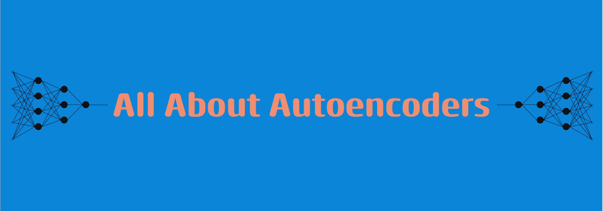

## ℹ️ About
---
Welcome to our comprehensive project on autoencoders, where we start with introducing the motivations and purposes of autoencoder architectures. From there, we cover how to implement the (Vanilla) Autoencoder (AE), Variational Autoencoder (VAE), and finally, the more SOTA [Vector-Quantized Variational Autoencoder (VQVAE)](https://arxiv.org/pdf/1711.00937.pdf). These implemntations are supplemented with an array of informative ablations, visualizations, and conceptual problems. Our "Where to Go Next" and "References" sections are great resources for additional learning. 

This resource was created as a final project for UC Berkeley's Deep Learning course [CS 182](https://inst.eecs.berkeley.edu/~cs182/). If you enjoyed your experience using this resource, we would appreciate sharing and starring of the repo so that others can gain value from the project. *We are more than happy to receive feedback through Github Issues.* There's a lot of great info in this README, but if you want to jump right in, go straight ahead to the Setup section and get started! Happy Learning!

## 💻 Setup
---
There are two ways to interact with our project. One can choose to utilize Google Colab OR run the notebooks locally. Regardless of the environment, we recommend using a GPU for the VQ-VAE notebook.

### Google Colab Setup
1. Clone or copy the repository to your local device.
2. Upload the entire repository folder to Google Colab.
3. When you start with the notebooks, ensure your RunTime is GPU enabled (although it's not a requirement; just makes training a bit faster).

### Local Setup

1. Clone or copy the repository to your local device.
2. We recommend setting up a [Conda](https://conda.io/projects/conda/en/latest/user-guide/install/index.html) environment for this project. Once you have Conda set up on your device, create an 
```bash
conda create --name your_env_name python=3.8
```
3. Now, setup the project to be editable using:
```bash
python setup.py develop
```
4. Finally, install dependencies, and you should be ready to learn!
```bash
pip install -r requirements.txt
```

Start with the AE_VAE.ipynb notebook. The directions should be very detailed and sequential, and it is recommended to have the conceptual guide open as a companion to your work. Once completed, go to the VQ_VAE.ipynb notebook.

## ✔️ Meta-Commentary
---
Our project is sequentially laid out in such a way that *the notebooks paired with the conceptual guide serve as a detailed outline of the concepts being covered*. Nevertheless, here is a brief non-exhaustive, outline of concepts covered. **Note to CS 182 Reviewers: Please refer to our full commentary.**

1. Motivating the "Why?" For Autoencoders
2. Basic Autoencoder architecture and use cases
3. AE Motivation and Implementation
4. VAE Motivation and Implementation
5. VQ-VAE Motivation and Implementation
6. AE, VAE, and VQ-VAE Ablations & Visualizations
    - Loss Visualization
    - Reconstruction Visualization
    - AE/VAE Latent Space Visualization
    - Denoising Ablation
    - Sample Generation Ablation
7. Conceptual/Mathematical Underpinnings
8. Additional Resources and Current SOTA

Elements of the project we were especially excited about:

* Covering the bottleneck/architecture progression from AE to VAE to VQ-VAE using our own explanations and mathematical problems!
* 2D and 3D Latent Space Visualization!
* Sample Generation (especially for VAE and VQ-VAE)!

## 🗺️ Where to Go Next
---
1.   [CVAE](https://papers.nips.cc/paper_files/paper/2015/hash/8d55a249e6baa5c06772297520da2051-Abstract.html): Conditional VAEs are the next step following VAEs. The formulation allows for a more deterministic method for generating samples.
2.   [RQVAE](http://arxiv.org/abs/2203.01941): The next stage of progress in extending the capabilities of the VQ-VAE.
3.   [MISA](http://arxiv.org/abs/2005.03545): A fascinating use of AE architectures for multi-modal sentiment analysis.
4.   [GANs](http://arxiv.org/abs/1406.2661): Generative Adversarial Networks (GANs) are somewhat similar in motivation to AE architectures. At a very high-level, it's much like an "inverted" AE that has the sole purpose of data generation and data discrimination.
5.   Anomaly Detection: AE and GAN-like architectures being used in this subfield of research is very common.
  - https://doi.org/10.1186/s42400-022-00134-9
  - http://arxiv.org/abs/1511.05644
  - http://arxiv.org/abs/2003.10713


## 📖 References
---
1. Anello, E. (2022, December 4). Convolutional Autoencoder in Pytorch on MNIST dataset. DataSeries. https://medium.com/dataseries/convolutional-autoencoder-in-pytorch-on-mnist-dataset-d65145c132ac
2. Ch. 9—Object Detection and Segmentation. (n.d.). Retrieved April 23, 2023, from https://manipulation.csail.mit.edu/segmentation.html
3. Denoising MNIST images using autoencoder. (n.d.). Retrieved April 23, 2023, from https://kaggle.com/code/theblackmamba31/denoising-mnist-images-using-autoencoder
4. Dertat, A. (2017, October 8). Applied Deep Learning - Part 3: Autoencoders. Medium. https://towardsdatascience.com/applied-deep-learning-part-3-autoencoders-1c083af4d798
5. Dobilas, S. (2022, May 2). VAE: Variational Autoencoders — How to Employ Neural Networks to Generate New Images. Medium. https://towardsdatascience.com/vae-variational-autoencoders-how-to-employ-neural-networks-to-generate-new-images-bdeb216ed2c0
6. Dosovitskiy, A., Beyer, L., Kolesnikov, A., Weissenborn, D., Zhai, X., Unterthiner, T., Dehghani, M., Minderer, M., Heigold, G., Gelly, S., Uszkoreit, J., & Houlsby, N. (2021). An Image is Worth 16x16 Words: Transformers for Image Recognition at Scale (arXiv:2010.11929). arXiv. http://arxiv.org/abs/2010.11929
7. Goodfellow, I. J., Pouget-Abadie, J., Mirza, M., Xu, B., Warde-Farley, D., Ozair, S., Courville, A., & Bengio, Y. (2014). Generative Adversarial Networks (arXiv:1406.2661). arXiv. http://arxiv.org/abs/1406.2661
8. Gu, S., Chen, D., Bao, J., Wen, F., Zhang, B., Chen, D., Yuan, L., & Guo, B. (2022). Vector Quantized Diffusion Model for Text-to-Image Synthesis (arXiv:2111.14822). arXiv. http://arxiv.org/abs/2111.14822
9. Hay+Rice. (2018, September 24). How to Train Your ResNet. Myrtle. https://myrtle.ai/learn/how-to-train-your-resnet/
10. Hazarika, D., Zimmermann, R., & Poria, S. (2020). MISA: Modality-Invariant and -Specific Representations for Multimodal Sentiment Analysis (arXiv:2005.03545). arXiv. http://arxiv.org/abs/2005.03545
11. Hinton, G. E., & Salakhutdinov, R. R. (2006). Reducing the Dimensionality of Data with Neural Networks. Science, 313(5786), 504–507. https://doi.org/10.1126/science.1127647
12. Lee, D., Kim, C., Kim, S., Cho, M., & Han, W.-S. (2022). Autoregressive Image Generation using Residual Quantization (arXiv:2203.01941). arXiv. http://arxiv.org/abs/2203.01941
13. Makhzani, A., Shlens, J., Jaitly, N., Goodfellow, I., & Frey, B. (2016). Adversarial Autoencoders (arXiv:1511.05644). arXiv. http://arxiv.org/abs/1511.05644
14. Oord, A. van den, Vinyals, O., & Kavukcuoglu, K. (2018). Neural Discrete Representation Learning (arXiv:1711.00937). arXiv. http://arxiv.org/abs/1711.00937
15. Rocca, J. (2021, March 21). Understanding Variational Autoencoders (VAEs). Medium. https://towardsdatascience.com/understanding-variational-autoencoders-vaes-f70510919f73
16. Sahai, A., Yang, X., & Seal, S. (n.d.). Lecture 16: Self-Supervision and Autoencoders (cont.).
17. Sohn, K., Lee, H., & Yan, X. (2015). Learning Structured Output Representation using Deep Conditional Generative Models. Advances in Neural Information Processing Systems, 28. https://papers.nips.cc/paper_files/paper/2015/hash/8d55a249e6baa5c06772297520da2051-Abstract.html
18. Somepalli, G., Wu, Y., Balaji, Y., Vinzamuri, B., & Feizi, S. (2021). Unsupervised Anomaly Detection with Adversarial Mirrored AutoEncoders (arXiv:2003.10713). arXiv. http://arxiv.org/abs/2003.10713
19. Torabi, H., Mirtaheri, S. L., & Greco, S. (2023). Practical autoencoder based anomaly detection by using vector reconstruction error. Cybersecurity, 6(1), 1. https://doi.org/10.1186/s42400-022-00134-9
20. Vincent, P., Larochelle, H., Lajoie, I., Bengio, Y., & Manzagol, P.-A. (n.d.). Stacked Denoising Autoencoders: Learning Useful Representations in a Deep Network with a Local Denoising Criterion.


## 🖋️ Project Authors

[Chancharik Mitra](https://www.linkedin.com/in/chancharik-m-151756178/), Jason Zhang, [Joshua You](https://www.linkedin.com/in/joshua-you-1ba9ab1b3/), [Michael Huang](https://www.linkedin.com/in/themichaelhuang/)
